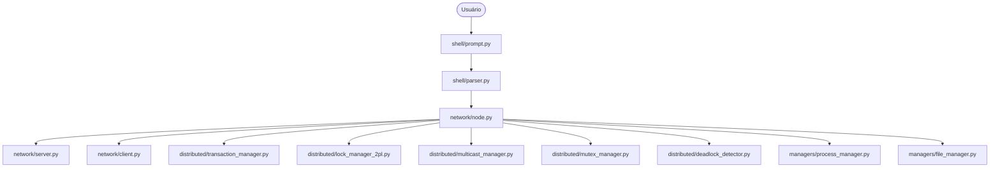

# Relatório Técnico: MiniShell Linux Distribuída

**Disciplina:** Computação Distribuída e Paralela  
**Professor:** Ronaldo Oikawa  
**Autor:** Kauan dos Santos Loche  
**Instituição:** UNESP  

---

## 1. Arquitetura Geral da Solução

O sistema foi modelado como um conjunto de processos autônomos e cooperativos executados sob um ambiente de rede TCP. Cada nó instancia uma `MiniShell` que atua como interface de comando interativo (CLI) e possui threads em segundo plano gerenciando conexões de rede e protocolos de coordenação distribuída.



A arquitetura de pacotes e diretórios foi modularizada da seguinte forma:
- `network/`: Abstração de comunicação soquete TCP síncrona/assíncrona e gerenciamento de conexões de peers.
- `distributed/`: Implementação de todos os protocolos avançados (Eleição, Exclusão Mútua, Transações, Consenso, Multicast Ordenado, 2PC, Detecção de Deadlocks).
- `managers/`: Acesso local ao SO (processos, threads e escrita em disco).
- `shell/`: Interpretador de comandos local e prompt interativo.

---

## 2. Descrição dos Algoritmos Implementados

### 2.1 Eleição de Líder
- **Algoritmo Valentão (Bully):** O nó que detecta a falha do líder envia uma mensagem de `ELECTION` para todos os nós de maior prioridade. Se nenhum responder com `OK` dentro do tempo de timeout, declara-se o novo coordenador e envia `COORDINATOR` para todos os peers inferiores.
- **Chang e Roberts (Anel):** Organiza logicamente os nós em um anel sequencial. O iniciador envia `RING_ELECTION` contendo seu ID para seu sucessor ativo (pulando nós falhos se necessário). Cada nó que recebe a mensagem compara o ID da mensagem com o seu: se for maior, encaminha; se for menor e ainda não estiver participando, substitui o ID pelo seu próprio e encaminha; se for igual, descobriu-se o líder e circula um anúncio de `RING_COORDINATOR`.

### 2.2 Exclusão Mútua Distribuída
- **Ricart e Agrawala:** Quando um nó deseja obter acesso exclusivo a um recurso, ele incrementa seu Relógio de Lamport e faz um multicast da requisição com o timestamp (`RICART_REQUEST`). Os outros nós decidem responder (`RICART_REPLY`) imediatamente ou adiar a resposta baseados em: se já possuem a trava do recurso, se querem a trava e possuem timestamp menor ou igual. O nó adquire a trava quando recebe replies de todos os nós ativos.
- **Maekawa:** Divide os nós em conjuntos de votação (quóruns) que se cruzam mutuamente. Criamos um gerador de quórum baseado em matriz bidimensional $R \times C$. Um nó só entra na seção crítica quando recebe voto favorável (`MAEKAWA_VOTE`) de todos os membros do seu quórum. Ao sair, envia `MAEKAWA_RELEASE`.

### 2.3 Ordenação de Comunicação em Grupo
- **FIFO:** Controlado por números de sequência locais por remetente. O receptor armazena mensagens fora de ordem em uma fila de espera (`HoldbackQueue`) até que a sequência correta seja completada.
- **Causal:** Implementado usando relógios vetoriais (Vector Clocks). As mensagens trazem o carimbo de tempo vetorial do remetente. A entrega é adiada até que a mensagem seja a próxima causal e que todas as dependências causais anteriores já tenham sido processadas localmente.
- **Total:** Usa um Sequenciador Central (o líder do anel/Bully). Todas as mensagens a serem replicadas são passadas ao sequenciador, que atribui um número de sequência global fixo e as envia aos demais nós, garantindo que todos apliquem exatamente na mesma ordem de sequência global.

### 2.4 Consenso
- Implementado um consenso em duas fases: Proposta e Decisão. Cada nó propõe um valor (ex: entrada de dicionário ou número). O coordenador consolida todas as propostas dentro de um timeout e aplica uma função determinística livre de conflitos (mínimo lexicográfico ou numérico), retornando o valor de consenso final aos participantes.

### 2.5 Transações Distribuídas, Controle de Concorrência & 2PC
- **Transações Aninhadas e Lock Inheritance:** Suporta subtransações recursivas. Cada subtransação executa isoladamente. Ao ser abortada, suas travas são descartadas. Ao ser confirmada, suas travas são herdadas por sua transação pai direto até a transação de nível superior.
- **Strict 2-Phase Locking (Strict 2PL):** Impede leituras sujas e atualizações perdidas retendo todas as travas exclusivas e compartilhadas obtidas pela transação até o Commit Global.
- **Commit em Duas Fases (2PC):** O coordenador envia `PREPARE` para todos os participantes da transação. Se todos votarem `TX_VOTE_COMMIT`, o coordenador grava `COMMIT` no log persistente e envia `TX_GLOBAL_COMMIT`. Caso contrário (ou timeout), grava e transmite `TX_GLOBAL_ABORT`.

---

## 3. Estruturas de Dados Utilizadas

1. **`wfg` (Wait-For Graph):** Um dicionário de mapeamento orientado em `LockManager2PL` que registra qual ID de transação está aguardando liberação de lock por qual conjunto de transações. Usado para detecção de ciclo.
2. **`vector_clock`:** Dicionário `{node_id: sequence_number}` mantendo o relógio lógico vetorial para rastrear a causalidade em tempo real.
3. **`lock_table`:** Tabela hash registrando a posse de travas (`resource -> LockState`).
4. **`tx_parents`:** Árvore direcionada `{subtx_id: parent_id}` para mapeamento e processamento de herança de locks em subtransações.

---

## 4. Formato das Mensagens

Toda mensagem trafega serializada em formato JSON sob TCP contendo a seguinte estrutura básica:

```json
{
  "type": "MESSAGE_TYPE_STRING",
  "sender": 1,
  "payload": {},
  "sequence": 5
}
```

Exemplo de requisição Ricart-Agrawala:
```json
{
  "type": "RICART_REQUEST",
  "sender": 2,
  "payload": {
    "resource": "dados.txt",
    "timestamp": 12
  },
  "sequence": null
}
```

---

## 5. Fluxogramas dos Algoritmos

### 5.1 Eleição em Anel (Chang-Roberts)

```
[Início do Processo]
        |
        v
[Deseja Eleição?] 
  Sim -> Define participating = True, envia RING_ELECTION(meu_ID) para Sucessor.
        |
        v
[Recebe RING_ELECTION(max_id)]
        |
        +---> (max_id > meu_ID) -> Define participating = True, repassa max_id.
        |
        +---> (max_id < meu_ID) -> Se participating for False, define True e repassa meu_ID.
        |                          Se participating for True, descarta a mensagem.
        |
        +---> (max_id == meu_ID) -> Este nó venceu! 
                                   Define is_leader = True, participating = False,
                                   envia RING_COORDINATOR(meu_ID) ao Sucessor.
```

### 5.2 Commit em Duas Fases (2PC)

```
[Coordenador]                               [Participante]
      |                                           |
      |--- 1. Envia PREPARE --------------------->|
      |                                           | [Valida e grava Log]
      |<-- 2. Retorna Voto (COMMIT/ABORT) --------|
      |
[Consenso de Votos?]
  Sim -> Grava Log (COMMIT), envia GLOBAL_COMMIT ->|
  Não -> Grava Log (ABORT), envia GLOBAL_ABORT --->|
                                                  | [Aplica ou desfaz alterações]
                                                  | [Libera travas]
```

---

## 6. Análise de Complexidade de Mensagens

| Algoritmo | Complexidade de Mensagens (Melhor Caso) | Complexidade de Mensagens (Pior Caso) |
|---|---|---|
| **Bully (Eleição)** | $O(N)$ (nó com segundo maior ID inicia) | $O(N^2)$ (nó de menor ID inicia) |
| **Chang-Roberts (Eleição)** | $O(N \log N)$ (IDs decrescentes no anel) | $O(N)$ (IDs crescentes no anel) |
| **Ricart & Agrawala (Mutex)** | $2(N - 1)$ por entrada na seção crítica | $2(N - 1)$ |
| **Maekawa (Mutex)** | $3 \sqrt{N}$ por entrada | $5 \sqrt{N}$ (em caso de impasses/inquire) |
| **2-Phase Commit (2PC)** | $2(N - 1)$ por transação | $2(N - 1)$ (em caso de falha de participante) |

---

## 7. Comparação dos Mecanismos

### 7.1 Chang e Roberts × Bully
- **Complexidade:** Chang-Roberts consome muito menos mensagens em redes organizadas em anel ($O(N)$ no pior caso), enquanto Bully requer $O(N^2)$ devido ao broadcast generalizado.
- **Tolerância a Falhas:** Bully é extremamente resiliente a falhas concorrentes durante a própria eleição. Chang-Roberts original assume canal sem falhas no anel; no nosso projeto mitigamos isso pulando dinamicamente nós inativos do anel.

### 7.2 Ricart e Agrawala × Maekawa
- **Mensagens:** Ricart e Agrawala requer comunicação direta com todos os $N$ nós da rede. Maekawa reduz essa sobrecarga drasticamente solicitando votos apenas para um subconjunto de tamanho $2\sqrt{N}$, tornando o sistema muito mais escalável para redes grandes.
- **Segurança:** Ambos garantem exclusão mútua perfeita, mas Maekawa é propenso a deadlocks se as mensagens de quórum cruzarem de forma desordenada, exigindo mecanismos de timeout ou liberação prioritária.

### 7.3 FIFO × Causal × Total
- **FIFO:** Simples, garante que se o nó A envia $M_1$ e depois $M_2$, todos entregam $M_1$ antes. Porém, não ordena envios de nós diferentes.
- **Causal:** Preserva causa-efeito. Se a mensagem de B foi enviada após ler a mensagem de A, todos os nós processam A antes de B.
- **Total:** O mais restritivo. Garante que todos os nós da rede apliquem todas as mensagens exatamente na mesma ordem de recebimento global, prevenindo divergências de estado a custo de centralização no sequenciador.

---

## 8. Estratégias de Recuperação e Tolerância a Falhas

1. **Persistência de Transações (WAL):** Antes de aplicar qualquer alteração física na base de dados (sistema de arquivos), o nó grava a intenção no arquivo de log (`transaction_log_<id>.log`) usando `os.fsync()` para garantir escrita física no disco antes do commit.
2. **Crash-Recovery (Reviver):** Quando um nó é reativado após um `crash` (simulado ou real), o `TransactionManager` analisa o log:
   - Se encontrar `GLOBAL_COMMIT`, executa **REDO** aplicando as alterações da pasta de rascunhos para o diretório raiz local.
   - Se encontrar apenas `START` ou `PREPARE` sem commit correspondente, executa **UNDO** descartando a pasta de rascunhos e liberando quaisquer locks locais, restaurando a consistência local.
3. **Heartbeat Automatizado:** Threads secundárias pingam periodicamente o líder para verificar conectividade. A ausência de resposta dispara imediatamente uma nova eleição com base no algoritmo em uso.

---

## 9. Limitações Encontradas Durante a Implementação

1. **Chamadas de Sistema Fork no Windows:** Por se tratar de um ambiente originalmente baseado em POSIX/Linux, o comando `ls` e simulações locais usando `fork()` não são suportados de forma nativa sob soquetes Windows puro, exigindo execução estrita sob WSL ou Linux nativo.
2. **Subtransações Concorrentes:** A divisão de pastas temporárias por TID evita colisões de arquivos, mas a concorrência na escrita de subtransações paralelas na mesma árvore exige maior complexidade no sequenciamento de concorrência local.
